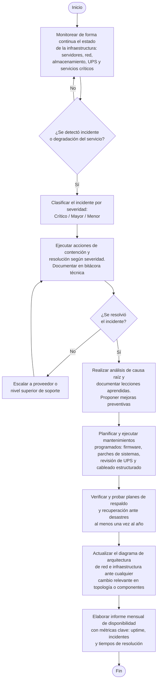

```mermaid
flowchart TD
    A([Inicio]) --> B[Monitorear de forma continua el estado<br/>de la infraestructura: servidores, red,<br/>almacenamiento, UPS y servicios críticos]

    B --> C{¿Se detectó incidente<br/>o degradación del servicio?}

    C -- No --> B

    C -- Sí --> D[Clasificar el incidente por severidad:<br/>Crítico / Mayor / Menor]

    D --> E[Ejecutar acciones de contención y<br/>resolución según severidad.<br/>Documentar en bitácora técnica]

    E --> F{¿Se resolvió<br/>el incidente?}

    F -- No --> G[Escalar a proveedor o<br/>nivel superior de soporte]
    G --> E

    F -- Sí --> H[Realizar análisis de causa raíz y<br/>documentar lecciones aprendidas.<br/>Proponer mejoras preventivas]

    H --> I[Planificar y ejecutar mantenimientos<br/>programados: firmware, parches de sistemas,<br/>revisión de UPS y cableado estructurado]

    I --> J[Verificar y probar planes de respaldo<br/>y recuperación ante desastres<br/>al menos una vez al año]

    J --> K[Actualizar el diagrama de arquitectura<br/>de red e infraestructura ante cualquier<br/>cambio relevante en topología o componentes]

    K --> L[Elaborar informe mensual de disponibilidad<br/>con métricas clave: uptime, incidentes<br/>y tiempos de resolución]

    L --> FIN([Fin])
```
