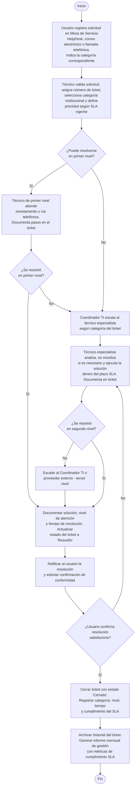

```mermaid
flowchart TD
    A([Inicio]) --> B[Usuario registra solicitud en Mesa de Servicio<br/>HelpDesk, correo electrónico o llamada telefónica.<br/>Indica la categoría correspondiente]

    B --> C[Técnico valida solicitud, asigna número de ticket,<br/>selecciona categoría institucional y define<br/>prioridad según SLA vigente]

    C --> D{¿Puede resolverse<br/>en primer nivel?}

    D -- Sí --> E[Técnico de primer nivel atiende<br/>remotamente o vía telefónica.<br/>Documenta pasos en el ticket]

    E --> F{¿Se resolvió<br/>en primer nivel?}

    F -- No --> G

    D -- No --> G[Coordinador TI escala al técnico especialista<br/>según categoría del ticket]

    F -- Sí --> I

    G --> H[Técnico especialista analiza, se moviliza<br/>si es necesario y ejecuta la solución<br/>dentro del plazo SLA. Documenta en ticket]

    H --> J{¿Se resolvió<br/>en segundo nivel?}

    J -- No --> K[Escalar al Coordinador TI o<br/>proveedor externo - tercer nivel]
    K --> I

    J -- Sí --> I[Documentar solución, nivel de atención<br/>y tiempo de resolución. Actualizar<br/>estado del ticket a 'Resuelto']

    I --> L[Notificar al usuario la resolución<br/>y solicitar confirmación de conformidad]

    L --> M{¿Usuario confirma resolución<br/>satisfactoria?}

    M -- No --> H

    M -- Sí --> N[Cerrar ticket con estado 'Cerrado'.<br/>Registrar categoría, nivel, tiempo<br/>y cumplimiento del SLA]

    N --> O[Archivar historial del ticket.<br/>Generar informe mensual de gestión<br/>con métricas de cumplimiento SLA]

    O --> FIN([Fin])
```
