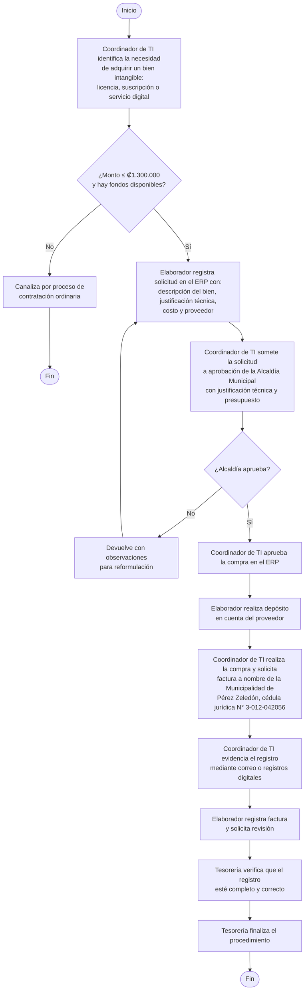

```mermaid
flowchart TD
    A([Inicio]) --> B[Coordinador de TI identifica la necesidad<br/>de adquirir un bien intangible:<br/>licencia, suscripción o servicio digital]

    B --> C{¿Monto ≤ ₡1.300.000<br/>y hay fondos disponibles?}

    C -- No --> D[Canaliza por proceso de<br/>contratación ordinaria]
    D --> FIN1([Fin])

    C -- Sí --> E[Elaborador registra solicitud en el ERP con:<br/>descripción del bien, justificación técnica,<br/>costo y proveedor]

    E --> F[Coordinador de TI somete la solicitud<br/>a aprobación de la Alcaldía Municipal<br/>con justificación técnica y presupuesto]

    F --> G{¿Alcaldía aprueba?}

    G -- No --> H[Devuelve con observaciones<br/>para reformulación]
    H --> E

    G -- Sí --> I[Coordinador de TI aprueba la compra en el ERP]

    I --> J[Elaborador realiza depósito<br/>en cuenta del proveedor]

    J --> K[Coordinador de TI realiza la compra y solicita<br/>factura a nombre de la Municipalidad de<br/>Pérez Zeledón, cédula jurídica N° 3-012-042056]

    K --> L[Coordinador de TI evidencia el registro<br/>mediante correo o registros digitales]

    L --> M[Elaborador registra factura<br/>y solicita revisión]

    M --> N[Tesorería verifica que el registro<br/>esté completo y correcto]

    N --> O[Tesorería finaliza el procedimiento]

    O --> FIN2([Fin])
```
