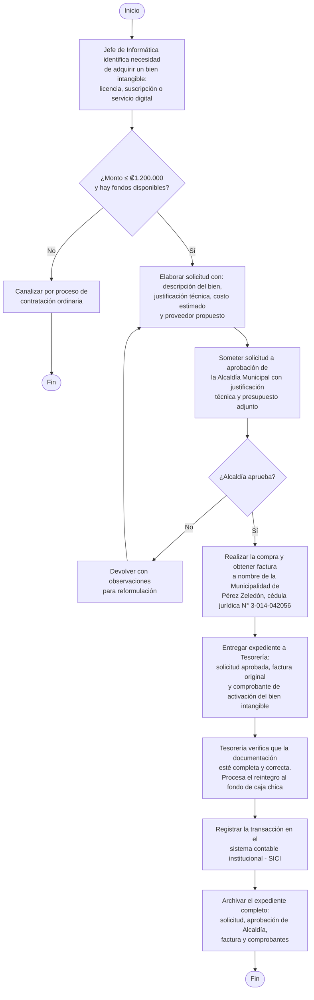

```mermaid
flowchart TD
    A([Inicio]) --> B[Jefe de Informática identifica necesidad<br/>de adquirir un bien intangible:<br/>licencia, suscripción o servicio digital]

    B --> C{¿Monto ≤ ₡1.200.000<br/>y hay fondos disponibles?}

    C -- No --> D[Canalizar por proceso de<br/>contratación ordinaria]
    D --> FIN1([Fin])

    C -- Sí --> E[Elaborar solicitud con: descripción del bien,<br/>justificación técnica, costo estimado<br/>y proveedor propuesto]

    E --> F[Someter solicitud a aprobación de<br/>la Alcaldía Municipal con justificación<br/>técnica y presupuesto adjunto]

    F --> G{¿Alcaldía aprueba?}

    G -- No --> H[Devolver con observaciones<br/>para reformulación]
    H --> E

    G -- Sí --> I[Realizar la compra y obtener factura<br/>a nombre de la Municipalidad de<br/>Pérez Zeledón, cédula jurídica N° 3-014-042056]

    I --> J[Entregar expediente a Tesorería:<br/>solicitud aprobada, factura original<br/>y comprobante de activación del bien intangible]

    J --> K[Tesorería verifica que la documentación<br/>esté completa y correcta.<br/>Procesa el reintegro al fondo de caja chica]

    K --> L[Registrar la transacción en el<br/>sistema contable institucional - SICI]

    L --> M[Archivar el expediente completo:<br/>solicitud, aprobación de Alcaldía,<br/>factura y comprobantes]

    M --> FIN2([Fin])
```
