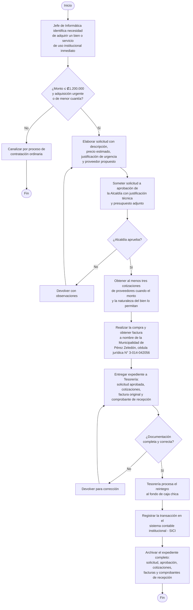

```mermaid
flowchart TD
    A([Inicio]) --> B[Jefe de Informática identifica necesidad<br/>de adquirir un bien o servicio<br/>de uso institucional inmediato]

    B --> C{¿Monto ≤ ₡1.200.000<br/>y adquisición urgente<br/>o de menor cuantía?}

    C -- No --> D[Canalizar por proceso de<br/>contratación ordinaria]
    D --> FIN1([Fin])

    C -- Sí --> E[Elaborar solicitud con descripción,<br/>precio estimado, justificación de urgencia<br/>y proveedor propuesto]

    E --> F[Someter solicitud a aprobación de<br/>la Alcaldía con justificación técnica<br/>y presupuesto adjunto]

    F --> G{¿Alcaldía aprueba?}

    G -- No --> H[Devolver con observaciones]
    H --> E

    G -- Sí --> I[Obtener al menos tres cotizaciones<br/>de proveedores cuando el monto<br/>y la naturaleza del bien lo permitan]

    I --> J[Realizar la compra y obtener factura<br/>a nombre de la Municipalidad de<br/>Pérez Zeledón, cédula jurídica N° 3-014-042056]

    J --> K[Entregar expediente a Tesorería:<br/>solicitud aprobada, cotizaciones,<br/>factura original y comprobante de recepción]

    K --> L{¿Documentación<br/>completa y correcta?}

    L -- No --> M[Devolver para corrección]
    M --> K

    L -- Sí --> N[Tesorería procesa el reintegro<br/>al fondo de caja chica]

    N --> O[Registrar la transacción en el<br/>sistema contable institucional - SICI]

    O --> P[Archivar el expediente completo:<br/>solicitud, aprobación, cotizaciones,<br/>facturas y comprobantes de recepción]

    P --> FIN2([Fin])
```
