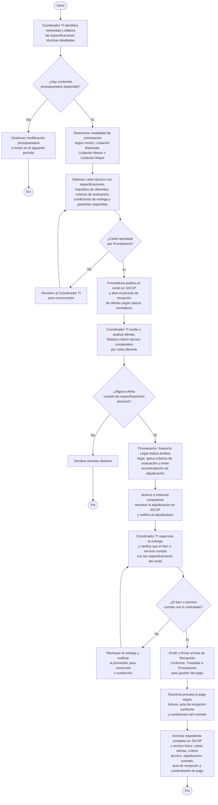

```mermaid
flowchart TD
    A([Inicio]) --> B[Coordinador TI identifica necesidad y elabora<br/>las especificaciones técnicas detalladas]

    B --> C{¿Hay contenido<br/>presupuestario disponible?}

    C -- No --> D[Gestionar modificación presupuestaria<br/>o incluir en el siguiente período]
    D --> FIN1([Fin])

    C -- Sí --> E[Determinar modalidad de contratación<br/>según monto: Licitación Reducida,<br/>Licitación Menor o Licitación Mayor]

    E --> F[Elaborar cartel técnico con especificaciones,<br/>requisitos de oferentes, criterios de evaluación,<br/>condiciones de entrega y garantías requeridas]

    F --> G{¿Cartel aprobado<br/>por Proveeduría?}

    G -- No --> H[Devolver al Coordinador TI<br/>para correcciones]
    H --> F

    G -- Sí --> I[Proveeduría publica el cartel en SICOP<br/>y abre el período de recepción<br/>de ofertas según plazos normativos]

    I --> J[Coordinador TI recibe y analiza ofertas.<br/>Elabora criterio técnico comparativo<br/>por cada oferente]

    J --> K{¿Alguna oferta<br/>cumple las especificaciones<br/>técnicas?}

    K -- No --> L[Declarar proceso desierto]
    L --> FIN2([Fin])

    K -- Sí --> M[Proveeduría / Asesoría Legal realiza análisis<br/>legal, aplica criterios de evaluación y emite<br/>recomendación de adjudicación]

    M --> N[Jerarca o instancia competente<br/>resuelve la adjudicación en SICOP<br/>y notifica al adjudicatario]

    N --> O[Coordinador TI supervisa la entrega<br/>y verifica que el bien o servicio cumpla<br/>con las especificaciones del cartel]

    O --> P{¿El bien o servicio<br/>cumple con lo contratado?}

    P -- No --> Q[Rechazar la entrega y notificar<br/>al proveedor para corrección<br/>o sustitución]
    Q --> O

    P -- Sí --> R[Emitir y firmar el Acta de Recepción<br/>Conforme. Trasladar a Proveeduría<br/>para gestión del pago]

    R --> S[Tesorería procesa el pago según<br/>factura, acta de recepción conforme<br/>y condiciones del contrato]

    S --> T[Archivar expediente completo en SICOP<br/>y archivo físico: cartel, ofertas, criterio<br/>técnico, adjudicación, contrato,<br/>acta de recepción y comprobante de pago]

    T --> FIN3([Fin])
```
