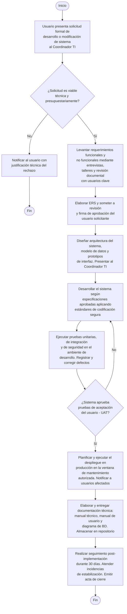

```mermaid
flowchart TD
    A([Inicio]) --> B[Usuario presenta solicitud formal de<br/>desarrollo o modificación de sistema<br/>al Coordinador TI]

    B --> C{¿Solicitud es viable<br/>técnica y presupuestariamente?}

    C -- No --> D[Notificar al usuario con<br/>justificación técnica del rechazo]
    D --> FIN1([Fin])

    C -- Sí --> E[Levantar requerimientos funcionales y<br/>no funcionales mediante entrevistas,<br/>talleres y revisión documental<br/>con usuarios clave]

    E --> F[Elaborar ERS y someter a revisión<br/>y firma de aprobación del<br/>usuario solicitante]

    F --> G[Diseñar arquitectura del sistema,<br/>modelo de datos y prototipos<br/>de interfaz. Presentar al Coordinador TI]

    G --> H[Desarrollar el sistema según<br/>especificaciones aprobadas aplicando<br/>estándares de codificación segura]

    H --> I[Ejecutar pruebas unitarias, de integración<br/>y de seguridad en el ambiente de<br/>desarrollo. Registrar y corregir defectos]

    I --> J{¿Sistema aprueba<br/>pruebas de aceptación<br/>del usuario - UAT?}

    J -- No --> H

    J -- Sí --> K[Planificar y ejecutar el despliegue en<br/>producción en la ventana de mantenimiento<br/>autorizada. Notificar a usuarios afectados]

    K --> L[Elaborar y entregar documentación técnica:<br/>manual técnico, manual de usuario y<br/>diagrama de BD. Almacenar en repositorio]

    L --> M[Realizar seguimiento post-implementación<br/>durante 30 días. Atender incidencias<br/>de estabilización. Emitir acta de cierre]

    M --> FIN2([Fin])
```
