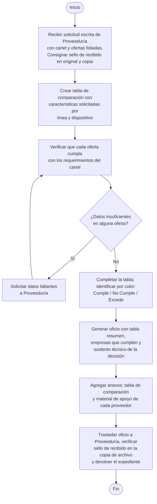

```mermaid
flowchart TD
    A([Inicio]) --> B[Recibir solicitud escrita de Proveeduría<br/>con cartel y ofertas foliadas.<br/>Consignar sello de recibido en original y copia]

    B --> C[Crear tabla de comparación con<br/>características solicitadas por<br/>línea y dispositivo]

    C --> D[Verificar que cada oferta cumpla<br/>con los requerimientos del cartel]

    D --> E{¿Datos insuficientes<br/>en alguna oferta?}

    E -- Sí --> F[Solicitar datos faltantes<br/>a Proveeduría]
    F --> D

    E -- No --> G[Completar la tabla; identificar por color:<br/>Cumple / No Cumple / Excede]

    G --> H[Generar oficio con tabla resumen,<br/>empresas que cumplen y<br/>sustento técnico de la decisión]

    H --> I[Agregar anexos: tabla de comparación<br/>y material de apoyo de cada proveedor]

    I --> J[Trasladar oficio a Proveeduría, verificar<br/>sello de recibido en la copia de archivo<br/>y devolver el expediente]

    J --> FIN([Fin])
```
