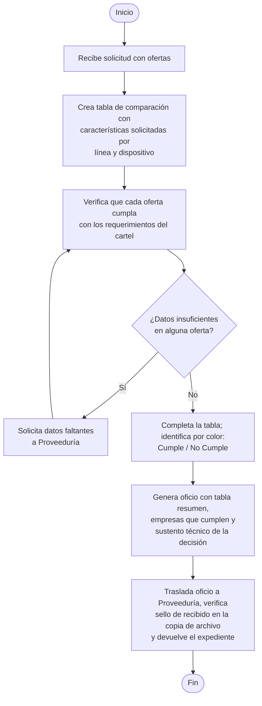

```mermaid
flowchart TD
    A([Inicio]) --> B[Recibe solicitud con ofertas]

    B --> C[Crea tabla de comparación con<br/>características solicitadas por<br/>línea y dispositivo]

    C --> D[Verifica que cada oferta cumpla<br/>con los requerimientos del cartel]

    D --> E{¿Datos insuficientes<br/>en alguna oferta?}

    E -- Sí --> F[Solicita datos faltantes<br/>a Proveeduría]
    F --> D

    E -- No --> G[Completa la tabla; identifica por color:<br/>Cumple / No Cumple]

    G --> H[Genera oficio con tabla resumen,<br/>empresas que cumplen y<br/>sustento técnico de la decisión]

    H --> I[Traslada oficio a Proveeduría, verifica<br/>sello de recibido en la copia de archivo<br/>y devuelve el expediente]

    I --> FIN([Fin])
```
