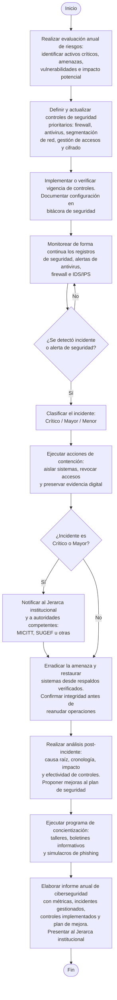

```mermaid
flowchart TD
    A([Inicio]) --> B[Realizar evaluación anual de riesgos:<br/>identificar activos críticos, amenazas,<br/>vulnerabilidades e impacto potencial]

    B --> C[Definir y actualizar controles de seguridad<br/>prioritarios: firewall, antivirus, segmentación<br/>de red, gestión de accesos y cifrado]

    C --> D[Implementar o verificar vigencia de controles.<br/>Documentar configuración en<br/>bitácora de seguridad]

    D --> E[Monitorear de forma continua los registros<br/>de seguridad, alertas de antivirus,<br/>firewall e IDS/IPS]

    E --> F{¿Se detectó incidente<br/>o alerta de seguridad?}

    F -- No --> E

    F -- Sí --> G[Clasificar el incidente:<br/>Crítico / Mayor / Menor]

    G --> H[Ejecutar acciones de contención:<br/>aislar sistemas, revocar accesos<br/>y preservar evidencia digital]

    H --> I{¿Incidente es<br/>Crítico o Mayor?}

    I -- Sí --> J[Notificar al Jerarca institucional<br/>y a autoridades competentes:<br/>MICITT, SUGEF u otras]
    J --> K

    I -- No --> K[Erradicar la amenaza y restaurar<br/>sistemas desde respaldos verificados.<br/>Confirmar integridad antes de<br/>reanudar operaciones]

    K --> L[Realizar análisis post-incidente:<br/>causa raíz, cronología, impacto<br/>y efectividad de controles.<br/>Proponer mejoras al plan de seguridad]

    L --> M[Ejecutar programa de concientización:<br/>talleres, boletines informativos<br/>y simulacros de phishing]

    M --> N[Elaborar informe anual de ciberseguridad<br/>con métricas, incidentes gestionados,<br/>controles implementados y plan de mejora.<br/>Presentar al Jerarca institucional]

    N --> FIN([Fin])
```
