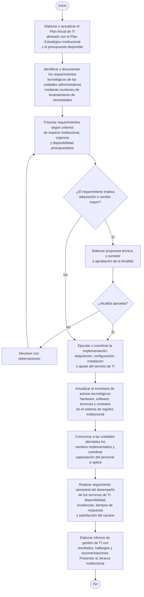

```mermaid
flowchart TD
    A([Inicio]) --> B[Elaborar o actualizar el Plan Anual de TI<br/>alineado con el Plan Estratégico Institucional<br/>y el presupuesto disponible]

    B --> C[Identificar y documentar los requerimientos<br/>tecnológicos de las unidades administrativas<br/>mediante reuniones de levantamiento de necesidades]

    C --> D[Priorizar requerimientos según criterios<br/>de impacto institucional, urgencia<br/>y disponibilidad presupuestaria]

    D --> E{¿El requerimiento implica<br/>adquisición o cambio mayor?}

    E -- Sí --> F[Elaborar propuesta técnica y someter<br/>a aprobación de la Alcaldía]

    F --> G{¿Alcaldía aprueba?}

    G -- No --> H[Devolver con observaciones]
    H --> D

    G -- Sí --> I

    E -- No --> I[Ejecutar o coordinar la implementación:<br/>adquisición, configuración, instalación<br/>o ajuste del servicio de TI]

    I --> J[Actualizar el inventario de activos tecnológicos:<br/>hardware, software, licencias y contratos<br/>en el sistema de registro institucional]

    J --> K[Comunicar a las unidades afectadas los<br/>cambios implementados y coordinar<br/>capacitación del personal si aplica]

    K --> L[Realizar seguimiento semestral del desempeño<br/>de los servicios de TI: disponibilidad,<br/>incidencias, tiempos de respuesta<br/>y satisfacción del usuario]

    L --> M[Elaborar informe de gestión de TI con<br/>resultados, hallazgos y recomendaciones.<br/>Presentar al Jerarca institucional]

    M --> FIN([Fin])
```
