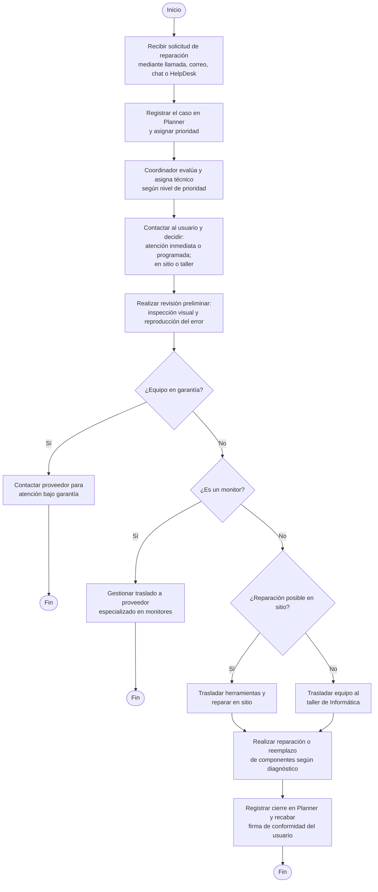

```mermaid
flowchart TD
    A([Inicio]) --> B[Recibir solicitud de reparación<br/>mediante llamada, correo, chat o HelpDesk]

    B --> C[Registrar el caso en Planner<br/>y asignar prioridad]

    C --> D[Coordinador evalúa y asigna técnico<br/>según nivel de prioridad]

    D --> E[Contactar al usuario y decidir:<br/>atención inmediata o programada;<br/>en sitio o taller]

    E --> F[Realizar revisión preliminar:<br/>inspección visual y reproducción del error]

    F --> G{¿Equipo en garantía?}

    G -- Sí --> H[Contactar proveedor para<br/>atención bajo garantía]
    H --> FIN1([Fin])

    G -- No --> I{¿Es un monitor?}

    I -- Sí --> J[Gestionar traslado a proveedor<br/>especializado en monitores]
    J --> FIN2([Fin])

    I -- No --> K{¿Reparación posible en sitio?}

    K -- Sí --> L[Trasladar herramientas y<br/>reparar en sitio]

    K -- No --> M[Trasladar equipo al<br/>taller de Informática]

    L --> N[Realizar reparación o reemplazo<br/>de componentes según diagnóstico]
    M --> N

    N --> O[Registrar cierre en Planner y recabar<br/>firma de conformidad del usuario]

    O --> FIN3([Fin])
```
