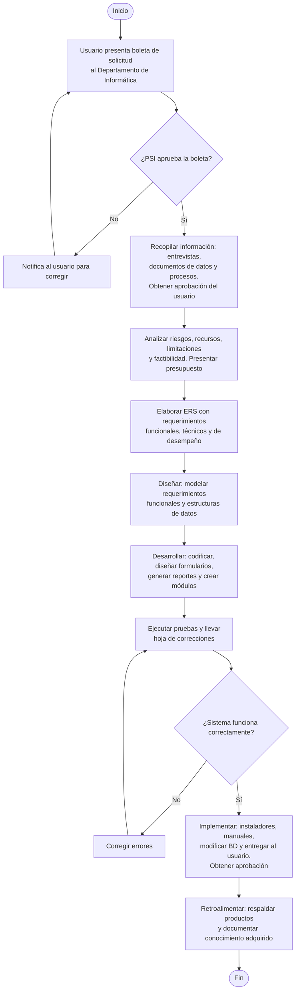

```mermaid
flowchart TD
    A([Inicio]) --> B[Usuario presenta boleta de solicitud<br/>al Departamento de Informática]

    B --> C{¿PSI aprueba la boleta?}

    C -- No --> D[Notifica al usuario para corregir]
    D --> B

    C -- Sí --> E[Recopilar información: entrevistas,<br/>documentos de datos y procesos.<br/>Obtener aprobación del usuario]

    E --> F[Analizar riesgos, recursos, limitaciones<br/>y factibilidad. Presentar presupuesto]

    F --> G[Elaborar ERS con requerimientos<br/>funcionales, técnicos y de desempeño]

    G --> H[Diseñar: modelar requerimientos<br/>funcionales y estructuras de datos]

    H --> I[Desarrollar: codificar, diseñar formularios,<br/>generar reportes y crear módulos]

    I --> J[Ejecutar pruebas y llevar<br/>hoja de correcciones]

    J --> K{¿Sistema funciona correctamente?}

    K -- No --> L[Corregir errores]
    L --> J

    K -- Sí --> M[Implementar: instaladores, manuales,<br/>modificar BD y entregar al usuario.<br/>Obtener aprobación]

    M --> N[Retroalimentar: respaldar productos<br/>y documentar conocimiento adquirido]

    N --> FIN([Fin])
```
