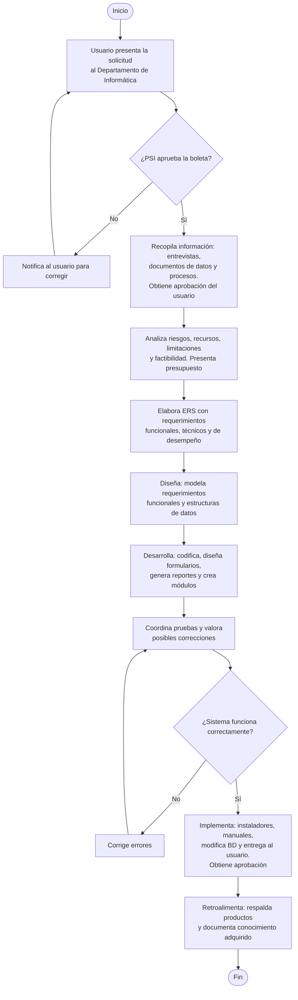

```mermaid
flowchart TD
    A([Inicio]) --> B[Usuario presenta la solicitud<br/>al Departamento de Informática]

    B --> C{¿PSI aprueba la boleta?}

    C -- No --> D[Notifica al usuario para corregir]
    D --> B

    C -- Sí --> E[Recopila información: entrevistas,<br/>documentos de datos y procesos.<br/>Obtiene aprobación del usuario]

    E --> F[Analiza riesgos, recursos, limitaciones<br/>y factibilidad. Presenta presupuesto]

    F --> G[Elabora ERS con requerimientos<br/>funcionales, técnicos y de desempeño]

    G --> H[Diseña: modela requerimientos<br/>funcionales y estructuras de datos]

    H --> I[Desarrolla: codifica, diseña formularios,<br/>genera reportes y crea módulos]

    I --> J[Coordina pruebas y valora<br/>posibles correcciones]

    J --> K{¿Sistema funciona correctamente?}

    K -- No --> L[Corrige errores]
    L --> J

    K -- Sí --> M[Implementa: instaladores, manuales,<br/>modifica BD y entrega al usuario.<br/>Obtiene aprobación]

    M --> N[Retroalimenta: respalda productos<br/>y documenta conocimiento adquirido]

    N --> FIN([Fin])
```
