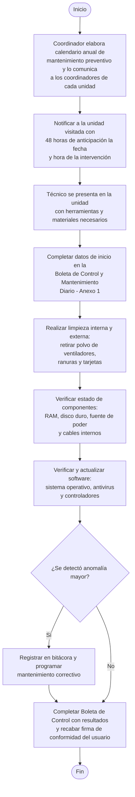

```mermaid
flowchart TD
    A([Inicio]) --> B[Coordinador elabora calendario anual de<br/>mantenimiento preventivo y lo comunica<br/>a los coordinadores de cada unidad]

    B --> C[Notificar a la unidad visitada con<br/>48 horas de anticipación la fecha<br/>y hora de la intervención]

    C --> D[Técnico se presenta en la unidad<br/>con herramientas y materiales necesarios]

    D --> E[Completar datos de inicio en la<br/>Boleta de Control y Mantenimiento<br/>Diario - Anexo 1]

    E --> F[Realizar limpieza interna y externa:<br/>retirar polvo de ventiladores,<br/>ranuras y tarjetas]

    F --> G[Verificar estado de componentes:<br/>RAM, disco duro, fuente de poder<br/>y cables internos]

    G --> H[Verificar y actualizar software:<br/>sistema operativo, antivirus<br/>y controladores]

    H --> I{¿Se detectó anomalía mayor?}

    I -- Sí --> J[Registrar en bitácora y programar<br/>mantenimiento correctivo]
    J --> K[Completar Boleta de Control con resultados<br/>y recabar firma de conformidad del usuario]

    I -- No --> K

    K --> FIN([Fin])
```
