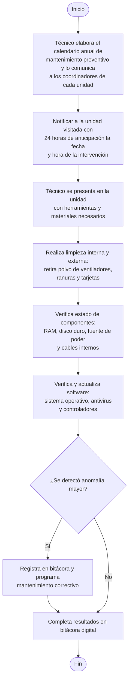

```mermaid
flowchart TD
    A([Inicio]) --> B[Técnico elabora el calendario anual de<br/>mantenimiento preventivo y lo comunica<br/>a los coordinadores de cada unidad]

    B --> C[Notificar a la unidad visitada con<br/>24 horas de anticipación la fecha<br/>y hora de la intervención]

    C --> D[Técnico se presenta en la unidad<br/>con herramientas y materiales necesarios]

    D --> E[Realiza limpieza interna y externa:<br/>retira polvo de ventiladores,<br/>ranuras y tarjetas]

    E --> F[Verifica estado de componentes:<br/>RAM, disco duro, fuente de poder<br/>y cables internos]

    F --> G[Verifica y actualiza software:<br/>sistema operativo, antivirus<br/>y controladores]

    G --> H{¿Se detectó anomalía mayor?}

    H -- Sí --> I[Registra en bitácora y programa<br/>mantenimiento correctivo]
    I --> J[Completa resultados en bitácora digital]

    H -- No --> J

    J --> FIN([Fin])
```
