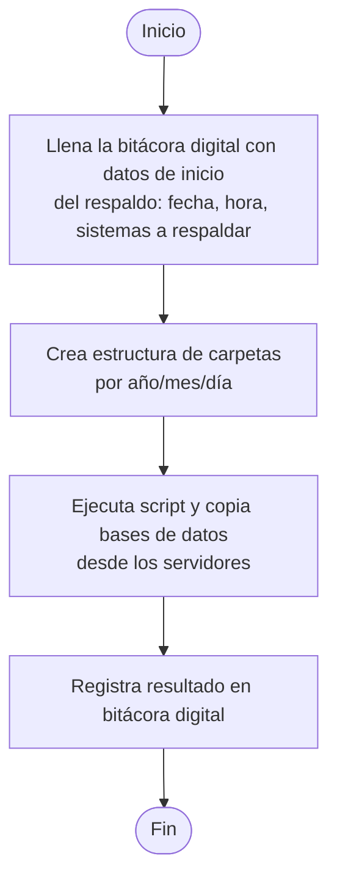

```mermaid
flowchart TD
    A([Inicio]) --> B[Llena la bitácora digital con datos de inicio<br/>del respaldo: fecha, hora, sistemas a respaldar]

    B --> C[Crea estructura de carpetas<br/>por año/mes/día]

    C --> D[Ejecuta script y copia bases de datos<br/>desde los servidores]

    D --> E[Registra resultado en bitácora digital]

    E --> FIN([Fin])
```
