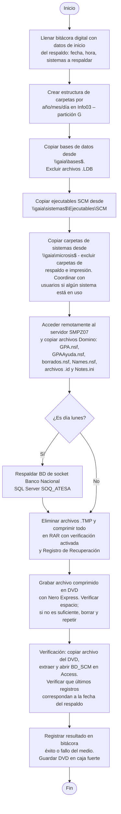

```mermaid
flowchart TD
    A([Inicio]) --> B[Llenar bitácora digital con datos de inicio<br/>del respaldo: fecha, hora, sistemas a respaldar]

    B --> C[Crear estructura de carpetas por<br/>año/mes/día en Info03 – partición G]

    C --> D[Copiar bases de datos desde<br/>\\gaia\bases$.<br/>Excluir archivos .LDB]

    D --> E[Copiar ejecutables SCM desde<br/>\\gaia\sistemas$\Ejecutables\SCM]

    E --> F[Copiar carpetas de sistemas desde<br/>\\gaia\microsis$ - excluir carpetas de<br/>respaldo e impresión. Coordinar con<br/>usuarios si algún sistema está en uso]

    F --> G[Acceder remotamente al servidor SMPZ07<br/>y copiar archivos Domino: GPA.nsf,<br/>GPAAyuda.nsf, borrados.nsf, Names.nsf,<br/>archivos .id y Notes.ini]

    G --> H{¿Es día lunes?}

    H -- Sí --> I[Respaldar BD de socket Banco Nacional<br/>SQL Server SOQ_ATESA]
    I --> J

    H -- No --> J[Eliminar archivos .TMP y comprimir todo<br/>en RAR con verificación activada<br/>y Registro de Recuperación]

    J --> K[Grabar archivo comprimido en DVD<br/>con Nero Express. Verificar espacio;<br/>si no es suficiente, borrar y repetir]

    K --> L[Verificación: copiar archivo del DVD,<br/>extraer y abrir BD_SCM en Access.<br/>Verificar que últimos registros<br/>correspondan a la fecha del respaldo]

    L --> M[Registrar resultado en bitácora<br/>éxito o fallo del medio.<br/>Guardar DVD en caja fuerte]

    M --> FIN([Fin])
```
