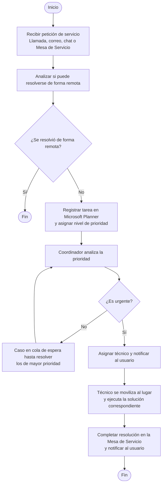

```mermaid
flowchart TD
    A([Inicio]) --> B[Recibir petición de servicio<br/>Llamada, correo, chat o Mesa de Servicio]

    B --> C[Analizar si puede resolverse de forma remota]

    C --> D{¿Se resolvió de forma remota?}

    D -- Sí --> FIN1([Fin])

    D -- No --> E[Registrar tarea en Microsoft Planner<br/>y asignar nivel de prioridad]

    E --> F[Coordinador analiza la prioridad]

    F --> G{¿Es urgente?}

    G -- No --> H[Caso en cola de espera hasta resolver<br/>los de mayor prioridad]
    H --> F

    G -- Sí --> I[Asignar técnico y notificar al usuario]

    I --> J[Técnico se moviliza al lugar<br/>y ejecuta la solución correspondiente]

    J --> K[Completar resolución en la Mesa de Servicio<br/>y notificar al usuario]

    K --> FIN2([Fin])
```
